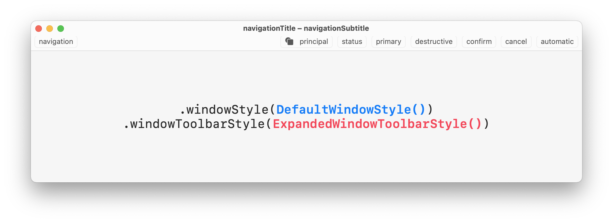
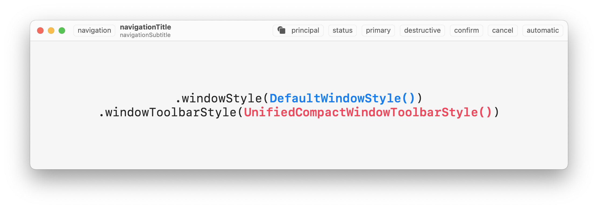
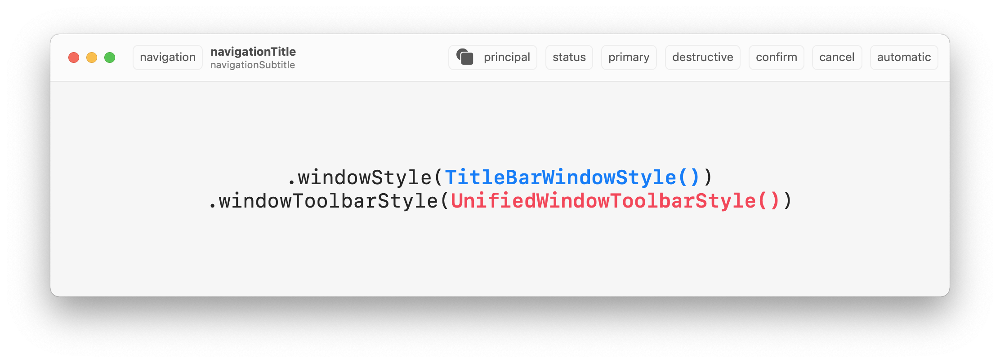
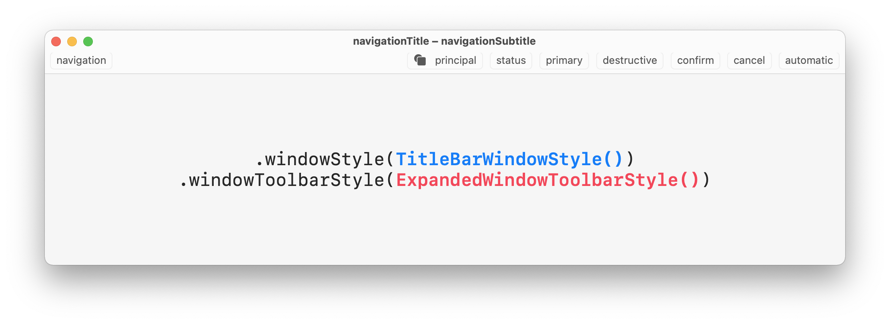
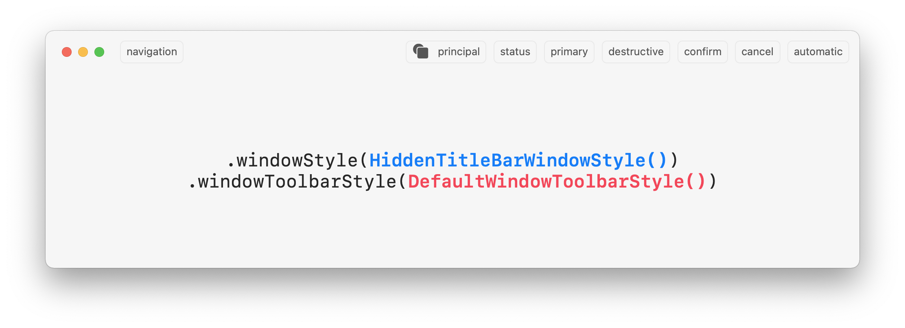
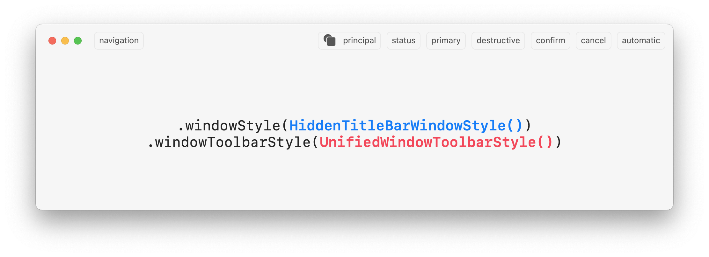
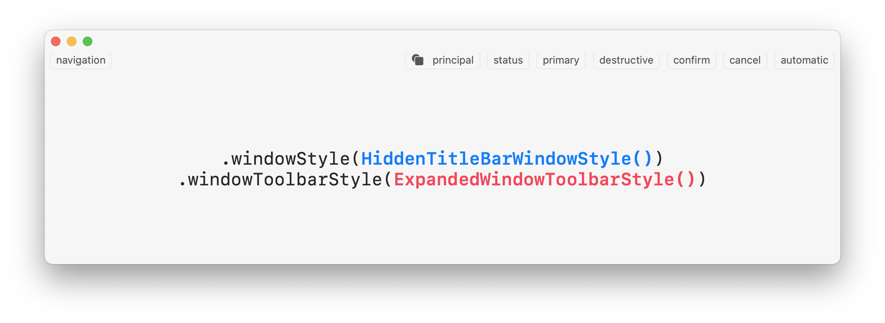
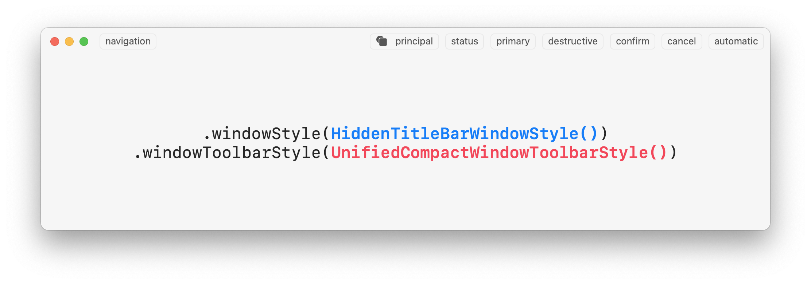

# SwiftUI .windowStyle() .windowToolbarStyle()

Showcase of window and toolbar style combinations possible with SwiftUI on macOS.

**→ How to use:** Add the `.windowStyle()` and `.windowToolbarStyle()` modifiers to `WindowGroup` within you `App` struct: 
```swift
WindowGroup { /* ... */ }
  .windowStyle(DefaultWindowStyle())
  .windowToolbarStyle(DefaultWindowToolbarStyle())
```

Take a look at the included [SwiftUI file](https://github.com/martinlexow/SwiftUIWindowStyles/blob/main/SwiftUIWindowStylesApp.swift) to see how to create the toolbar etc.

If you are an AppKit developer you might find this helpful as well: [NSWindowStyles](https://github.com/lukakerr/NSWindowStyles).

Please make a pull request if you have a style to add.

## DefaultWindowStyle()

### DefaultWindowToolbarStyle()


### UnifiedWindowToolbarStyle()


### ExpandedWindowToolbarStyle()


### UnifiedCompactWindowToolbarStyle()



## TitleBarWindowStyle()

### DefaultWindowToolbarStyle()


### UnifiedWindowToolbarStyle()


### ExpandedWindowToolbarStyle()


### UnifiedCompactWindowToolbarStyle()


## HiddenTitleBarWindowStyle()

### DefaultWindowToolbarStyle()


### UnifiedWindowToolbarStyle()


### ExpandedWindowToolbarStyle()


### UnifiedCompactWindowToolbarStyle()



## 🌀 Support
I’m Martin, an indie dev from Berlin. If you find this useful, please consider to support my work! You can find some great apps of mine on the [Mac App Store](https://apps.apple.com/developer/id955848754) 🌀
