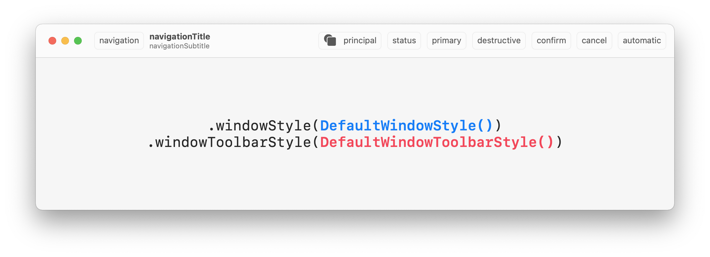

# SwiftUI .windowStyle() .toolbarStyle()

Showcase of window and toolbar style combinations possible with SwiftUI on macOS. Please make a pull request if you have a style to add!

```swift
WindowGroup { /* ... */ }
  .windowStyle(DefaultWindowStyle())
  .windowToolbarStyle(DefaultWindowToolbarStyle())
```

## DefaultWindowStyle()
### DefaultWindowToolbarStyle()




## 🌀 Support me
I’m Martin, an indie dev from Berlin. If you find Uberabout useful, please consider to support my work! You can find some great apps of mine on the [Mac App Store](https://apps.apple.com/developer/id955848754) 🌀
