# SwiftUI .windowStyle() .windowToolbarStyle()

Showcase of window and toolbar styles on macOS using SwiftUI.

**→ HOW TO:** Add the `.windowStyle()` and/or `.windowToolbarStyle()` modifiers to `WindowGroup` within you `App` struct: 
```swift
WindowGroup { /* ... */ }
  .windowStyle(.automatic)
  .windowToolbarStyle(.automatic)
```

🧑‍💻 Have a look at the [SwiftUI source file](https://github.com/martinlexow/SwiftUIWindowStyles/blob/main/SwiftUIWindowStylesApp.swift) in order to see how to create the toolbar etc.

🦖 If you are an AppKit developer you might find this helpful as well: [NSWindowStyles](https://github.com/lukakerr/NSWindowStyles).

Feel free to make a pull request if you have a style to add.

## .windowStyle(.automatic)

### .windowToolbarStyle(.automatic)
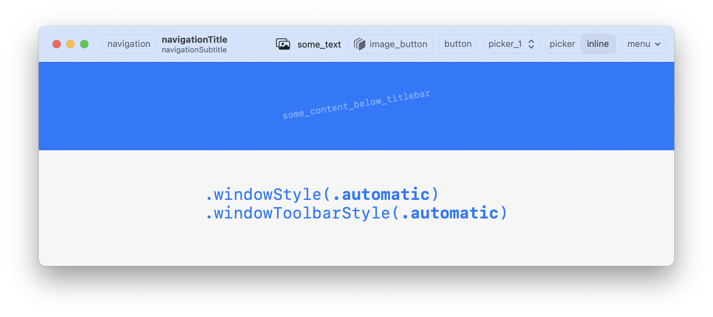

### .windowToolbarStyle(.expanded)
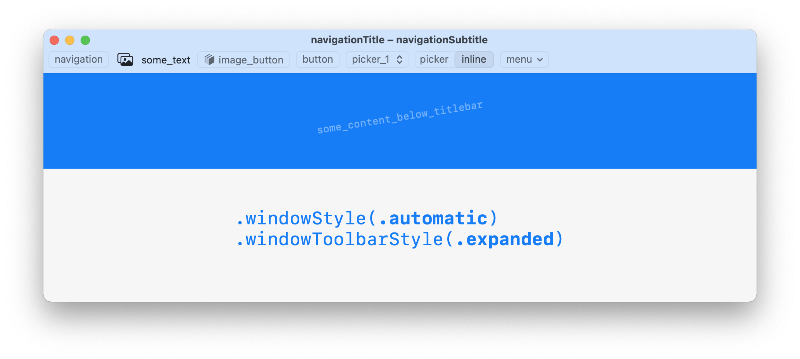

### .windowToolbarStyle(.unified)
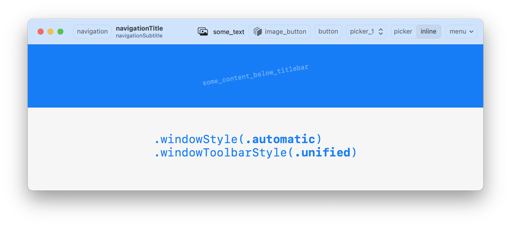

### .windowToolbarStyle(.unifiedCompact)
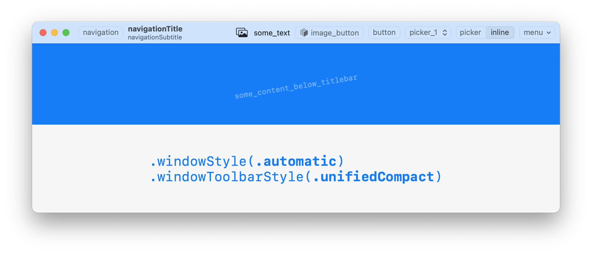


## .windowStyle(.hiddenTitleBar)

### .windowToolbarStyle(.automatic)
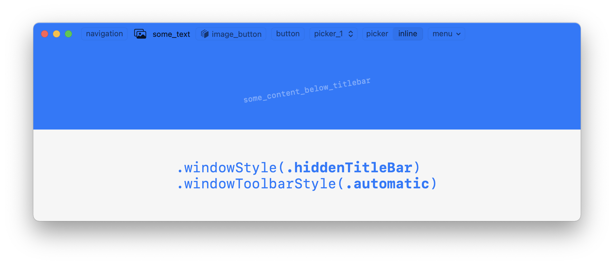

### .windowToolbarStyle(.expanded)
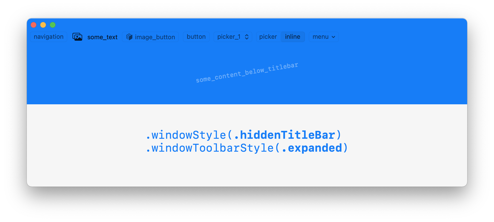

### .windowToolbarStyle(.unified)
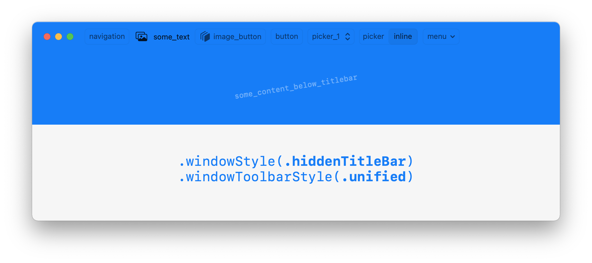

### .windowToolbarStyle(.unifiedCompact)
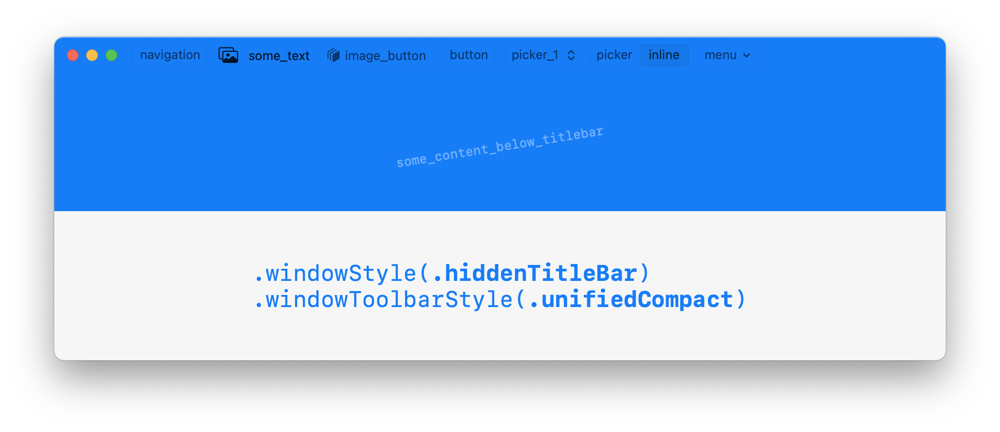


## .windowStyle(.titleBar)

### .windowToolbarStyle(.automatic)


### .windowToolbarStyle(.expanded)
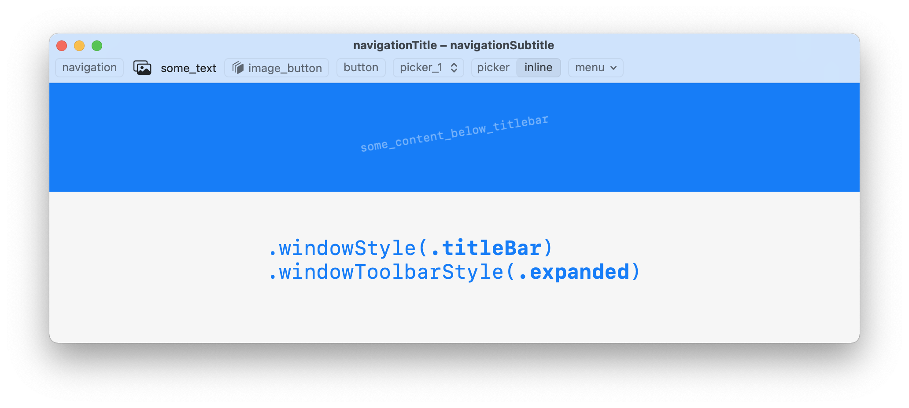

### .windowToolbarStyle(.unified)
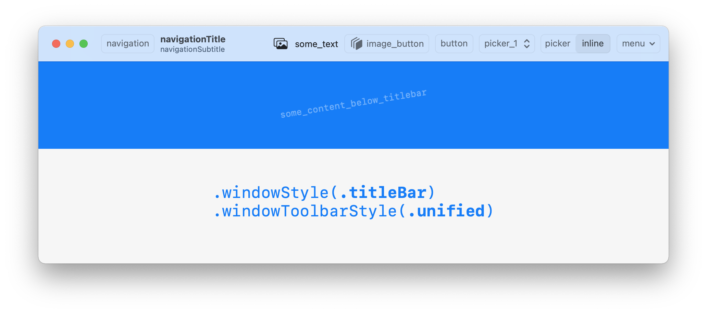

### .windowToolbarStyle(.unifiedCompact)
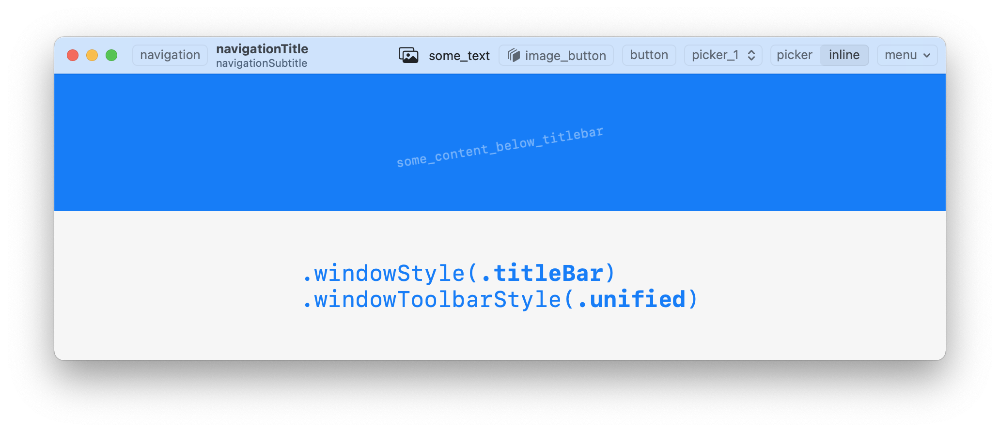


## About
I’m [Martin](https://martinlexow.de), an indie dev from Berlin. Enjoying my work? Have a look at some great apps of mine on the [Mac App Store](https://apps.apple.com/developer/id955848754) 🌀
